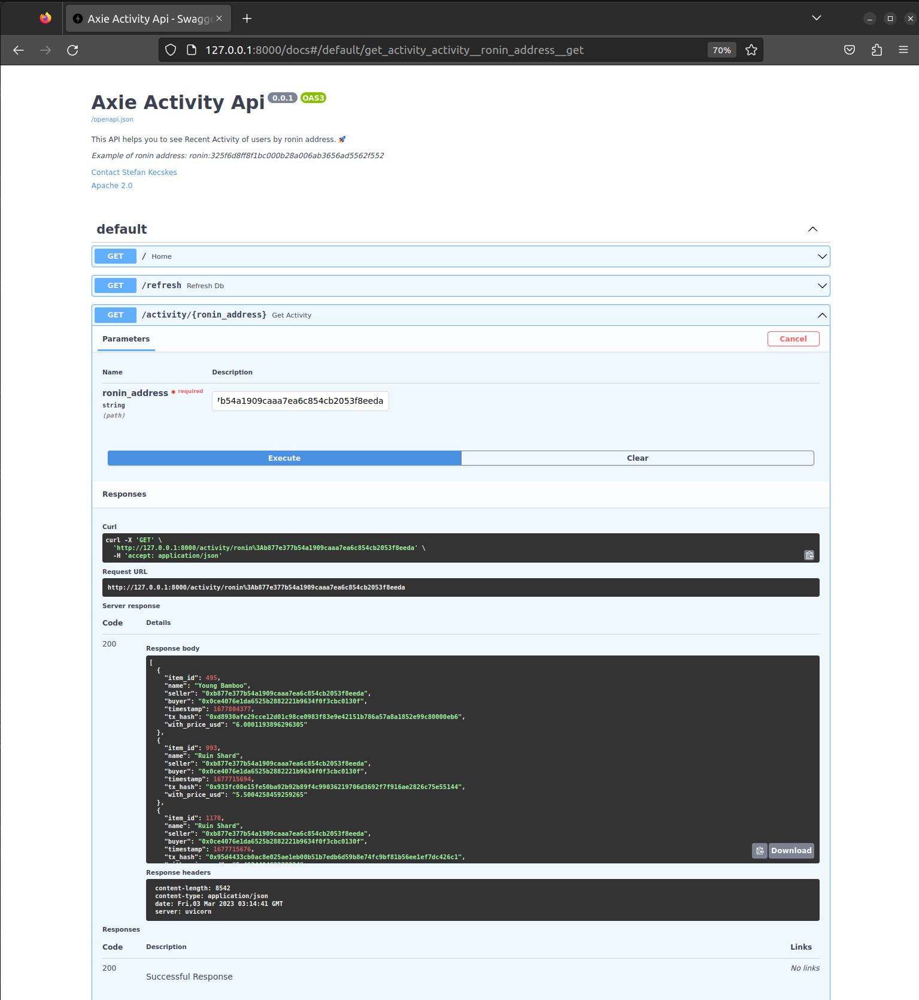

# Axie Activity API

## Dependencies

This API is now dependent on the ingestor and postgres DB docker instances. 
While ingestor ingests events from Ronin node and push the data to postgres DB,
this API will try to connect to DB and serve events from DB.

## Description

This is POC to [task.pdf](task.pdf). Just 2 endpoints: 

- GET /refresh -> endpoint will store last items sold, I believe it gets around 200 last events
- GET /activity/{ronin_address} endpoint will get item sales from DB

## Local run

**System requirements**
- python 3.7
- pip
- love for games

Create project specific environment for dependencies

    python3 -m venv .venv

Activate project libraries:

    source .venv/bin/activate

Install all project dependencies:

    pip install -r requirements.txt

Run the app

    uvicorn src.main:app --reload 

***Swagger available at http://127.0.0.1:8000/docs#/***
